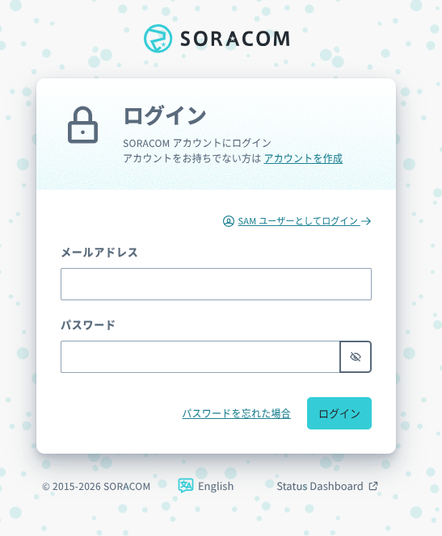
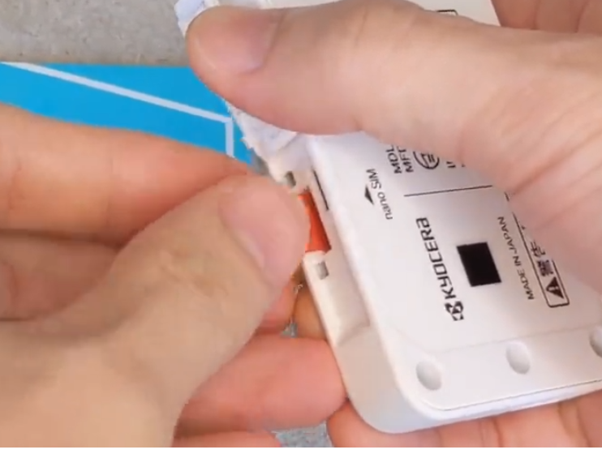
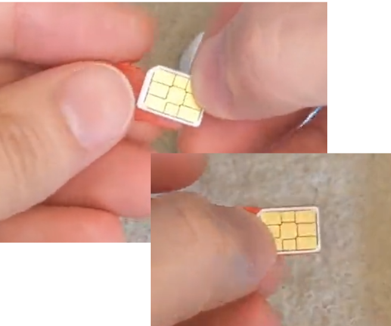
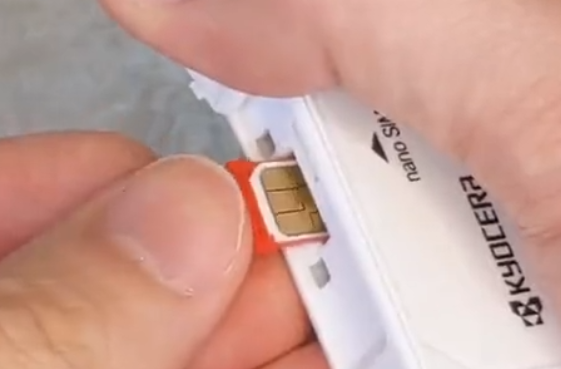
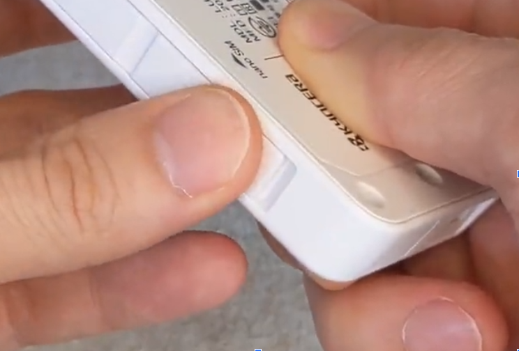

# 1: GPSマルチユニット初期設定(SIM登録～SIM取り付け)

## 前提

このドキュメントを進めるにあたって、以下のデバイスが必要となります。

- GPSマルチユニットSORACOM Edition
- SORACOM IoT SIM

このドキュメントを進めるにあたって、以下のアカウントが必要となります。

- SORACOM
- AWS

## 構成図

## ユーザーコンソールへのログイン手順

SORACOMユーザーコンソールへのログイン手順を解説します。

### ユーザーコンソールへログインする

[SORACOM ユーザーコンソール](https://auth.soracom.io/login/) へアクセスします。SAMユーザのログイン画面が表示されますので、ご自身のメールアドレス、パスワードを入力し [ログイン] ボタンをクリックしてください。



他要素認証設定済みの場合は、MFA認証コードを入力する画面に遷移します。設定済みのMFA認証コードを入力してください。

(図を入れる)

以下のようなダッシュボード画面が表示されたらログイン完了です。

(図を入れる)

## SIM を登録する

```text
SIM がすでに登録済み、もしくは登録済みの別の SIM を利用する場合は、この作業は不要です。次へお進みください。
```

GPS マルチユニットは SIM を挿入することでセルラー通信(LTE-M)を通じて、クラウドと連携できるようになります。そのため、まず SORACOM IoT SIM を SORACOM へ登録をしましょう。

登録の方法は[IMSI / PASSCODE / ICCID / PUK を入力して登録する](https://users.soracom.io/ja-jp/guides/getting-started/register-sim/#imsi--passcode--iccid--puk-%E3%82%92%E5%85%A5%E5%8A%9B%E3%81%97%E3%81%A6%E7%99%BB%E9%8C%B2%E3%81%99%E3%82%8B)をご覧ください。
※ジャンプ先ページの「最初の ICCID / 最後の ICCID / 認証パスコードを入力して登録する」以降は行わなくてOKです。

登録が完了すると SIM 管理の一覧に「準備中」として表示されます。ご確認ください。  
表示されない場合は、ブラウザの再読み込みを行ってください。

---
**SORACOM の便利な使い方: SIM の「名前」機能**  
SIM には「名前」を付けることができ、これで整理が可能です。特に複数の SIM (ボタン含む) をお持ちの際には、名前を付けることを強くお勧めいたします。  
名前の付け方は [SIM への名前の付け方](https://dev.soracom.io/jp/start/console/#name_tag)をご覧ください。

## SIM を GPS マルチユニットに取り付ける

SORACOM 特定地域向け IoT SIM (以下 SIM) をカードから切り離し、GPS マルチユニットの側面に挿入します。

この作業は[動画](https://www.youtube.com/watch?v=OmOoXtNY4jQ)でもご覧いただけます。  

### GPS マルチユニットの側面を開け、SIM トレイ (赤色) を取り出す

爪で引っ掛けるようにして取り出します。



### SIM を SIM トレイに乗せる。

SIM トレイに収まるように SIM を乗せます。SIM の方向に気をつけてください。また、SIM トレイは無くさないようにしてください。



### SIM トレイごと GPS マルチユニットに挿入する

元々入ってた向きで SIM トレイごと SIM を GPS マルチユニットに挿入します。このとき、SIM トレイから SIM が飛び出ないように気をつけてください。



最後に側面を閉じて終了です。



GPS マルチユニットに挿入した SIM の IMSI (クレジットカードサイズのカードの裏面に記載されている 15 桁の番号) を使用しますので、すぐ取り出せるようにしておいてください。

## これ以降のドキュメント

- [ガジェット設定〜Harvest動作確認](../chapter2/README.md)
- [SORACOM Funnel設定](../chapter3/README.md)
- [IoT Core設定～LocationService設定～動作確認](../chapter4/README.md)
- [中・上級者向け追加コンテンツ](../chapter5/README.md)
- [後片付け](../chapter99/README.md)
