# 2: GPSマルチユニット初期設定(ガジェット設定〜Harvest動作確認)

ガジェット設定を行い、動作確認として、GPSマルチユニットのクリックした際に SORACOM Harvest に対してデータをクリックタイプを保存する方法を解説します。

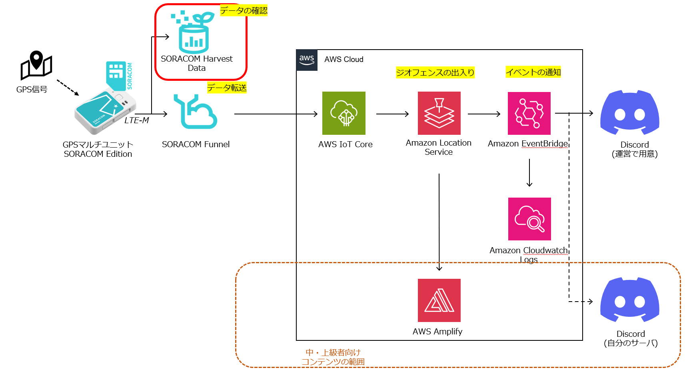

## ガジェット設定にて、グループを作成する。

1. [SORACOMユーザーコンソール](https://console.soracom.io/) の “Menu” から “ガジェット管理” の”GPSマルチユニット” をクリックします。

  
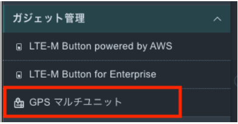

2. “GPSマルチユニットを追加”ボタンをクリックします。

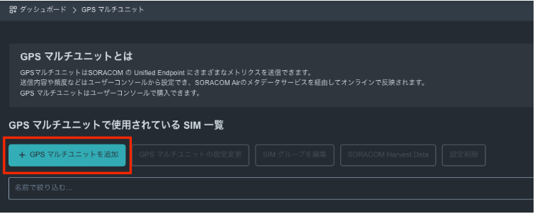

3. 今回使用するGPSマルチユニットで使うSIMが表示されているので、チェックを入れて、”次へ : グループを選択”をクリックします。

**※貸し出しの場合、一覧に利用するSIMが表示されていない場合は、チューターにご連絡ください。**

4. 新規グループを作成 を選び、グループ名に任意の名前 (たとえば “gps-multi-unit-group”)を入力して、”次へ : 設定を編集” をクリックします。

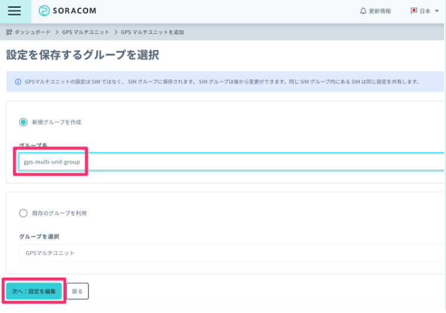

5. 送信先セクションの”SORACOM Harvest Data ( Lagoon)”にチェックを入れます。

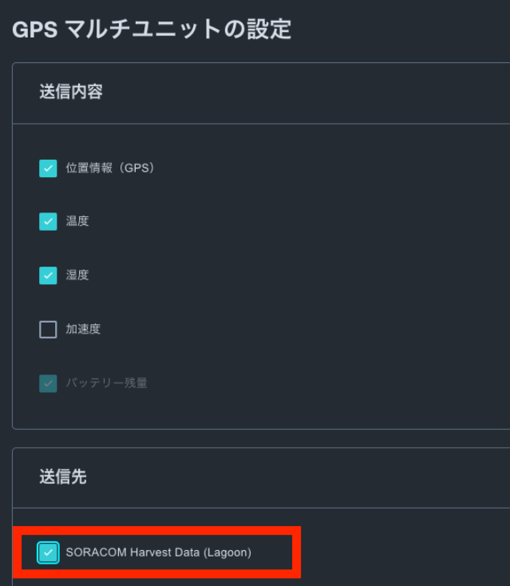

6. 定期送信 - 手動モード 詳細設定セクションの送信間隔に”1”(1分間隔)と入力します。(図は2となっていますが、1としてください)

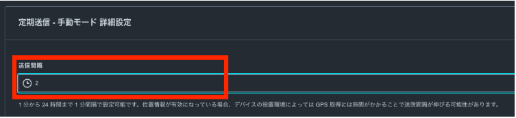

7. 画面下部の”保存”ボタンをクリックします。

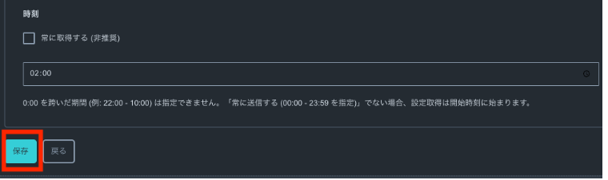

8. 設定完了のダイアログが出てくれば、完了です。GPSマルチユニットのファンクションボタンを押して、設定を反映させます。その後、”デバイス一覧に戻る”をクリックして、デバイス一覧画面に戻ります。

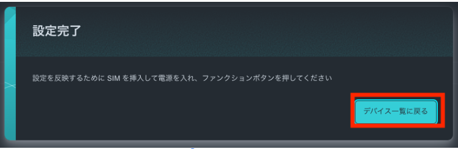  
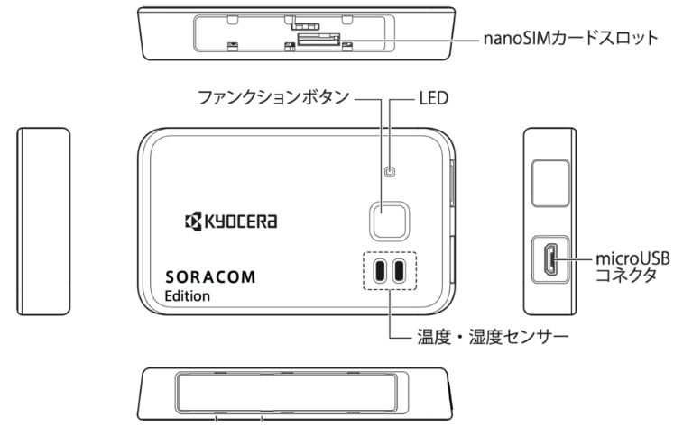

9. デバイス一覧にて、”SIMグループを編集”ボタンをクリックします。

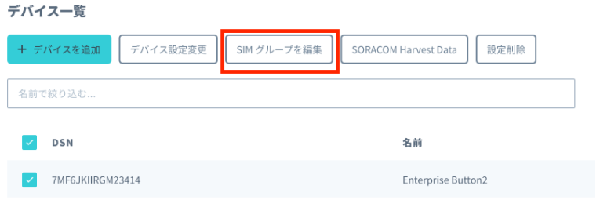

10. 作成したSIMグループの設定画面に移動しますので、SORACOM Air for セルラー設定 セクションで以下を入力します。

|  | |
| --- | --- |
| 設定名 | 任意 |
| バイナリパーサー | ON |
| フォーマット | @gpsmultiunit |

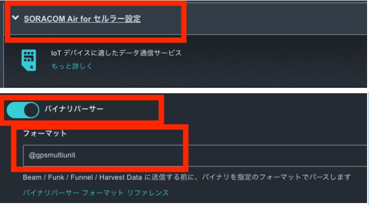

11. SORACOM Harvest Data 設定セクションにて、設定がONになっていることを確認します。

## Harvest を確認する

Harvest 上のデータを以下の手順で確認します。

1. “Menu” から “SIM 管理” を選択します。

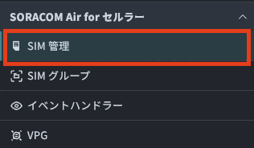

2. 使用するGPSマルチユニット の SIM の左端にある チェックボックスを選択し、”操作” => “Harvest Data を表示” を選択します。

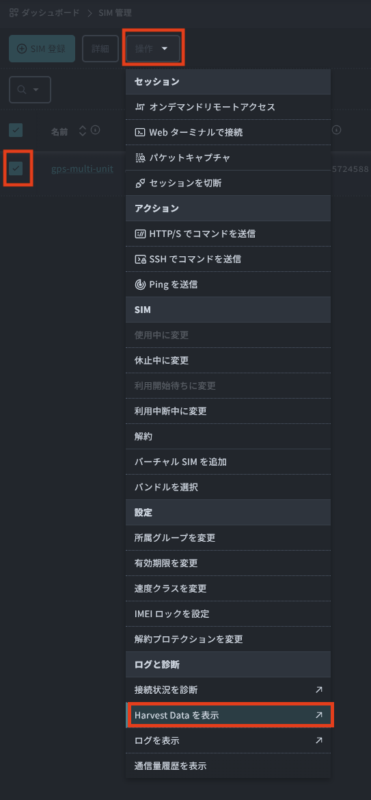

3. 1分間隔でGPSマルチユニットからデータが送信されていることが確認できます。
データ列の “lat” と “lon” が緯度・経度になります。もし、この2つが “null”の場合、GPSの信号を受信することができていない状態です。窓際に置くなどして見てください。

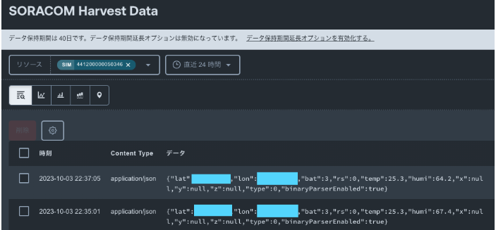

マップピンアイコンを選択することで表示を地図に変更して、位置情報を確認します。左上の “+” や “-“ でズームを調整できます。

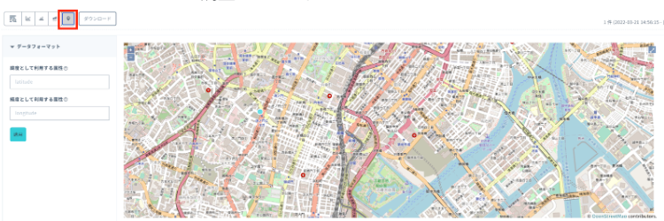

---
- 次: [3: SORACOM Funnel設定](../chapter3/README.md)

- 前: [1: GPSマルチユニット初期設定(SIM登録～SIM取り付け)](../chapter1/README.md)