# 3: SORACOM Funnel設定

## リージョンの選択

[AWSユーザーコンソール](https://console.aws.amazon.com/) にログインし、リージョンで"東京"(ap-northeast-1)を選んでください。

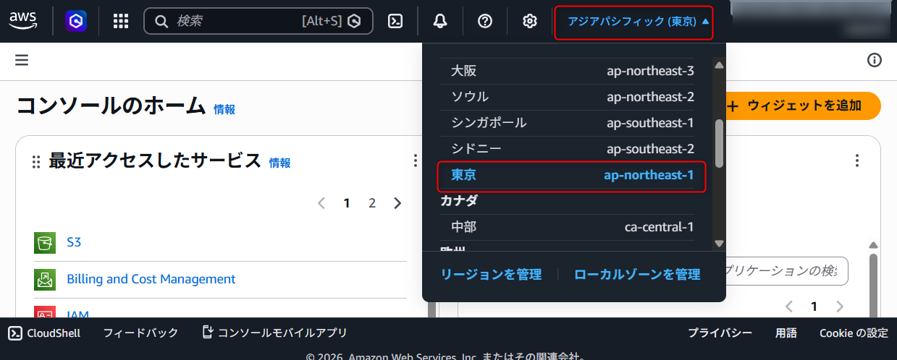

このテキストの内容は基本的にほとんどのリージョンで動作しますが、後半のLambdaレイヤーを指定する部分で東京リージョンを前提とした内容となっていますので、東京リージョンで作業するようにしてください。

東京リージョンにすでにリソースが存在する場合は、他のリソースに影響がないように注意して操作してください。

## IAMロールを作成する

SORACOM FunnelからAWS Iot Coreに接続するためのIAMロールを作成します。
AWSユーザーコンソールの検索窓に“iam”と入力し、表示されたサービス一覧から”IAM” をクリックします。}

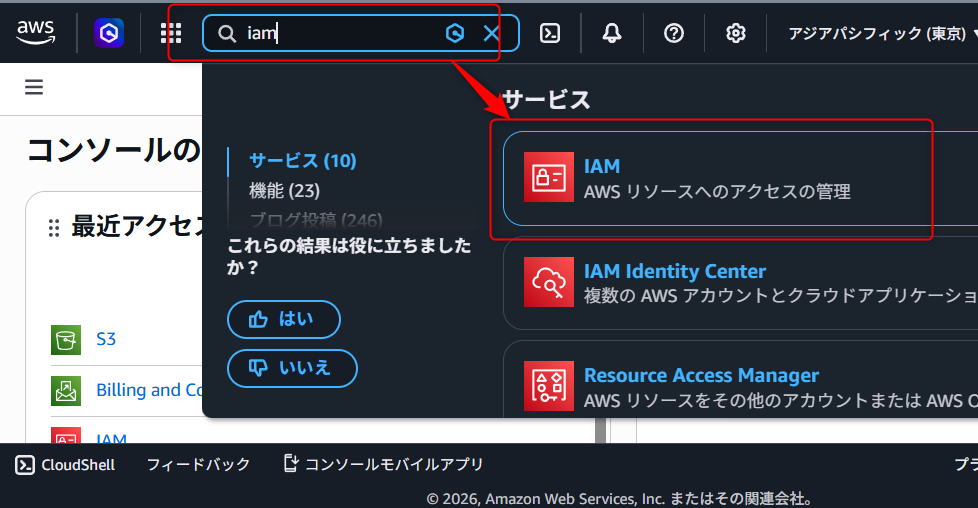

IAMのコンソールから"ポリシー">"ポリシーの作成"をクリックします。

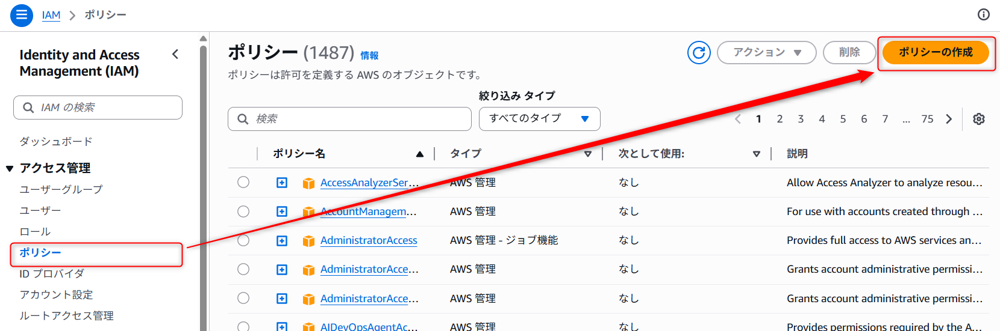

"サービスを選択"で"IoT"を選び、アクション許可で"書き込み"の”Publish”にチェックを入れ、"リソース"で"特定"を選び、"ARNを追加"をクリックします。

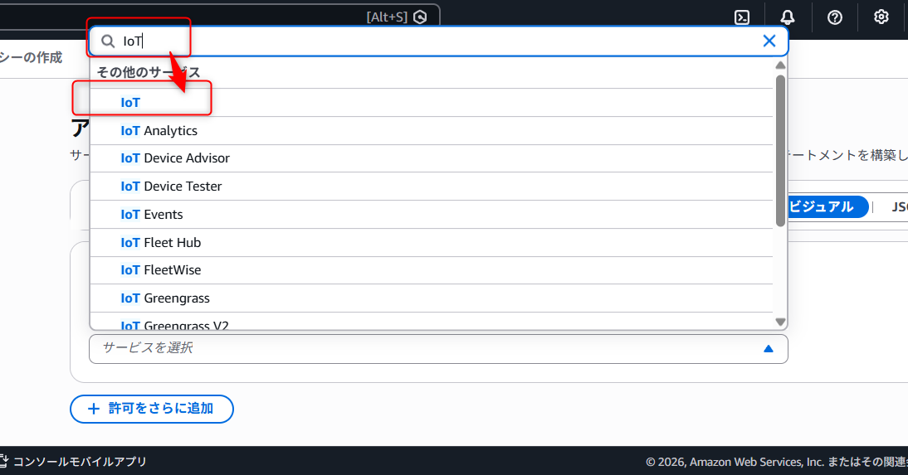

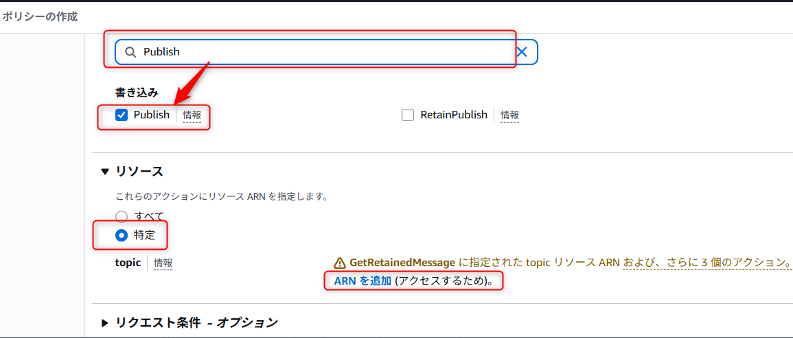

ARNを指定するウインドウで"次のリソース"で"このアカウント"を選び、"リソースのリージョン"は"任意のリージョン"にチェックを入れ、"Resource topic name"は`GPSMultiUnitHandson`と入力し、"ARNを追加"ボタンをクリックします。

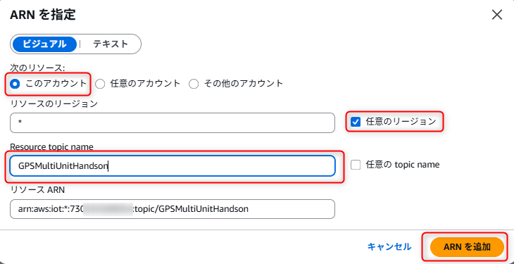

元の画面で"次へ"をクリックします。

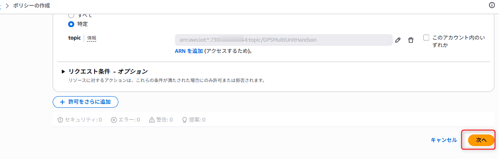

ポリシー名に`gps-multi-unit-handson-policy`と入力し、"ポリシーの作成"をクリックします。

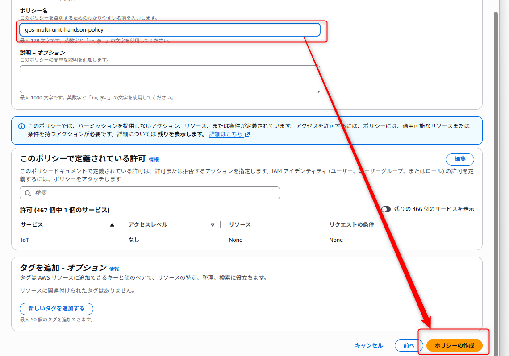

IAMのコンソールで、“ロール”>”ロールの作成”をクリックします。

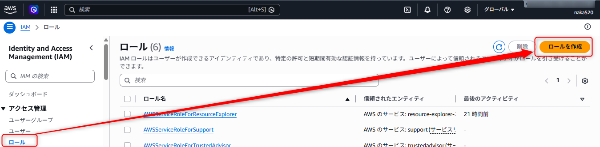

”信頼されたエンティティタイプ”で”AWSアカウント”を選択します。

"AWSアカウント"で"別のAWSアカウント"を選択し、アカウントIDに`762707677580`を入力します。また、オプションの"外部IDを要求する"にチェックを入れ、外部IDに`gps-multi-unit-handson`など、お好きな文字列を入力します。  
この外部IDはあとで利用するのでメモしておいて下さい。  
入力したら"次へ"をクリックします。

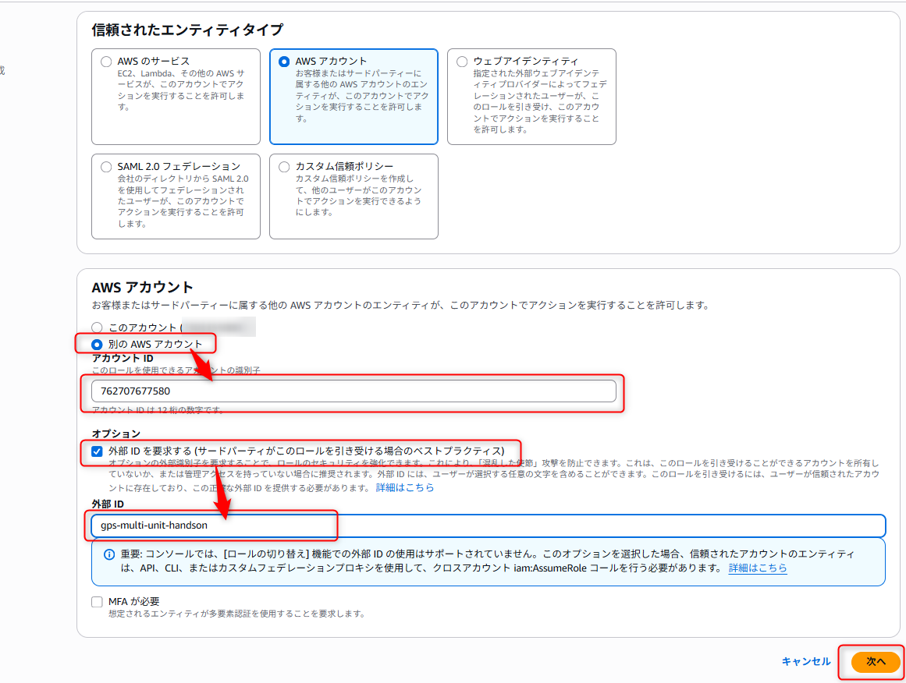

"許可を追加"で、先ほど作成した`gps-multi-unit-handson-policy`を選択肢、”次へ"をクリックします。

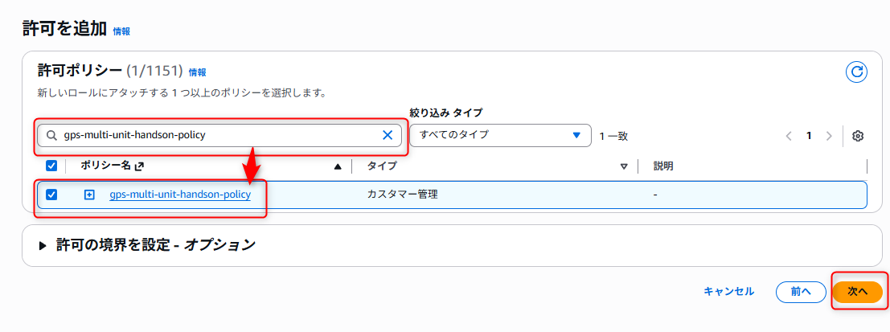

ロール名に`gps-multi-unit-handson-role`と入力し、”ロールを作成”をクリックします。

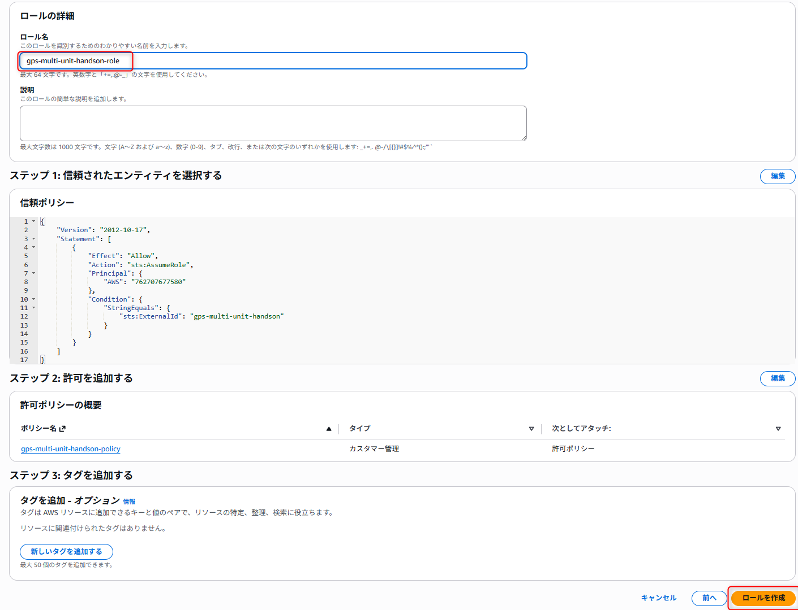

”ロールを表示”をクリックし、ロールのARNをメモしておきます。

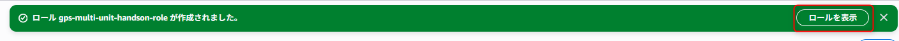

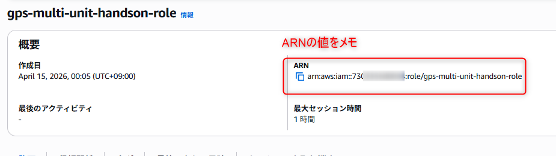

## IoT Coreのエンドポイントを確認する

SORACOM Funnelに設定する、IoT Coreのエンドポイントを以下の手順で確認します。
サービスの検索窓に“iot”と入力し、表示されたサービスから “IoT Core” を選びます。

左のメニューの"設定ドメイン設定"をクリックするとエンドポイントが表示されるのでメモしておきます。

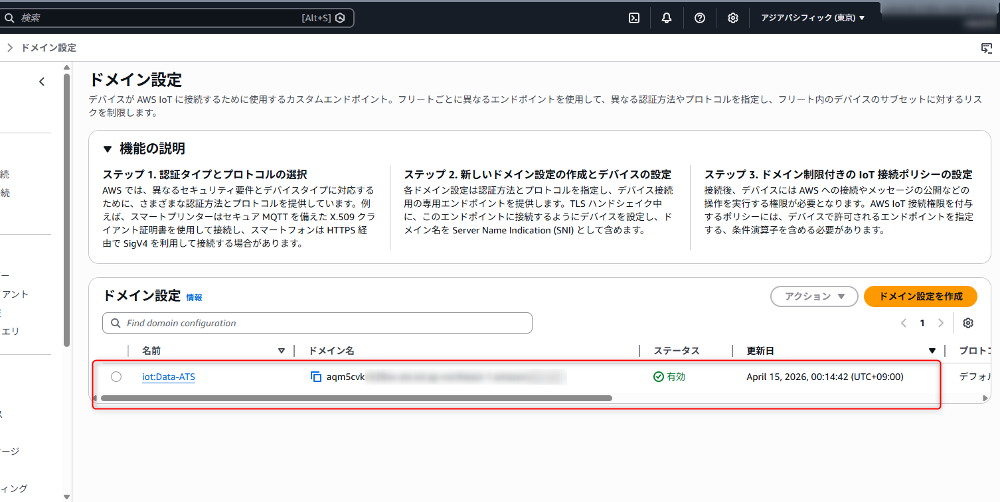

## SORACOM Funnelの設定をする

以下の手順でSORACOM Funnelを設定します。
SORACOMのユーザーコンソールで"ガジェット管理”>”GPSマルチユニット”と進みます。

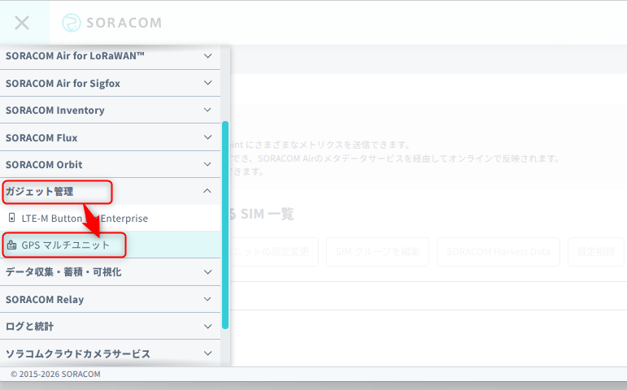

一覧に出てくるSIMの一覧から該当のSIMにチェックを入れ、"SIMグループを編集"をクリックします。

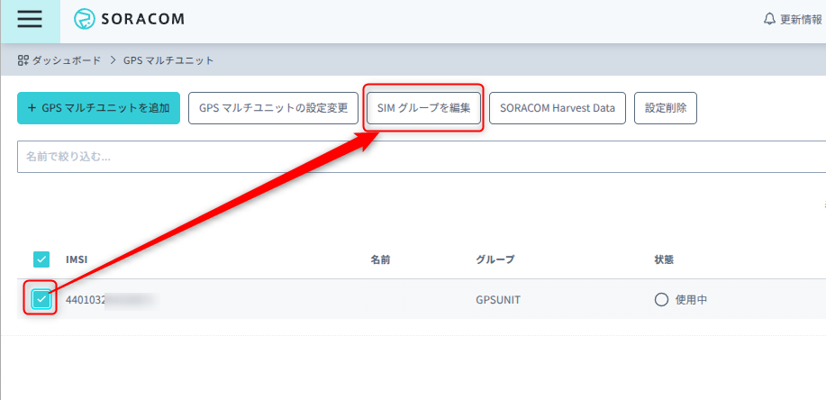

"SORACOM Funnel設定"をクリックし、スライダーを"ON"にし、転送先サービスは"AWS IoT"を選択し、"転送先URL"には"(保存しておいたAWS IoT Coreのアクセスポイント)/GPSMultiUnitHandson”を入力します。

"認証情報"の右のプラスボタンをクリックします。

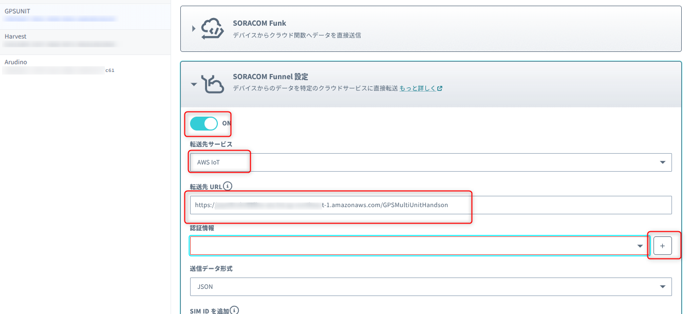

以下の通り入力します。

| 項目       | 値                                                 |
| ---------- | -------------------------------------------------- |
| 認証情報ID | gps_multi_unit_handson_key                         |
| 概要       | GPSマルチユニットのハンズオンで使用                |
| 種別       | AWS IAMロール認証情報                              |
| ロールARN  | 先ほど作成したIAMロールのARN                       |
| 外部ID     | 先ほど指定した外部ID(`gps-multi-unit-handson`など) |

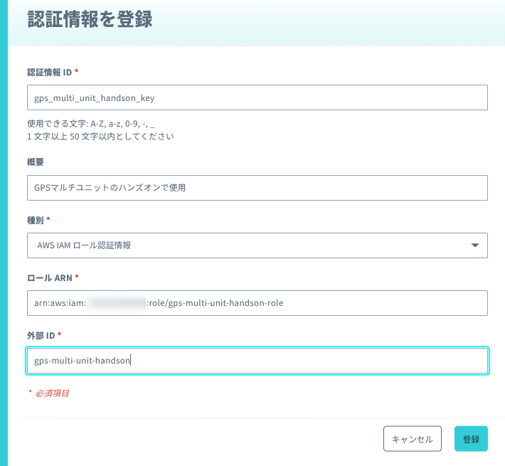

保存すると"認証情報"に作成した認証情報が選択された状態になります。
"送信データ形式"は"JSON"を選び、"保存"をクリックします。

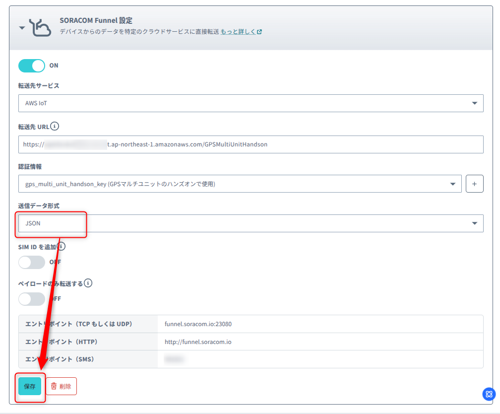

IoT Coreにデータが届いているか確認します。
AWSコンソールのIoT Coreの画面に戻り、左のメニューの"テスト">"MQTTテストクライアント"をクリックし、"トピックのフィルター"に"GPSMultiUnitHandson"を入力し、"サブスクライブ"をクリックします。

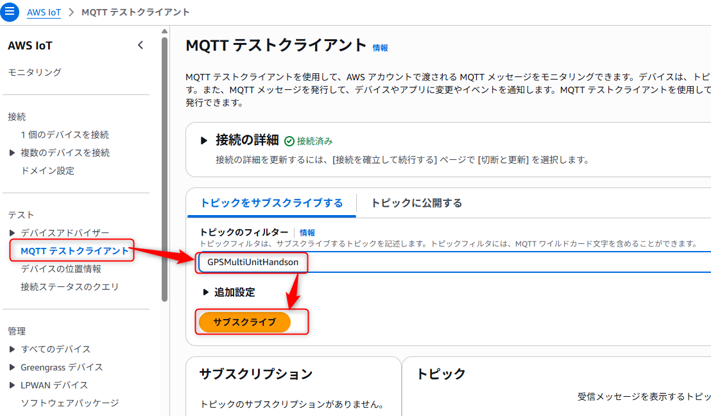

しばらく待って正常にデータが届くと、以下のように表示されます。

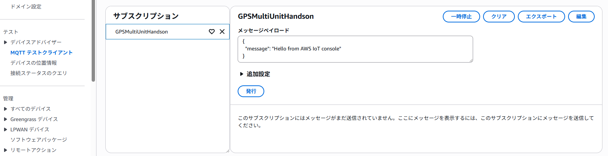

---

- 次: [4: IoT Core設定～LocationService設定～動作確認](../chapter4/README.md)

- 前: [2: GPSマルチユニット初期設定(SIM登録～SIM取り付け)](../chapter2/README.md)
