# 4: IoT Core設定～LocationService設定～動作確認

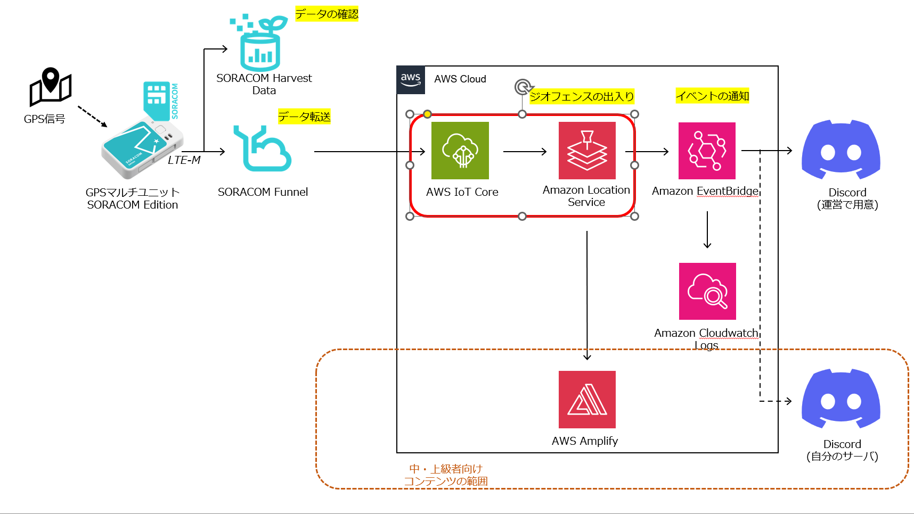

AWSのコンソールから、Amazon Location Serviceの設定を行います。
まず、IoT CoreからLocation Serviceへのデータルーティングの設定をします。

## IoT Coreのルーティングを設定する

IoT Coreのルーティングを以下の手順で確認します。
サービスの検索窓に“iot”と入力し、表示されたサービスから “IoT Core” を選びます。

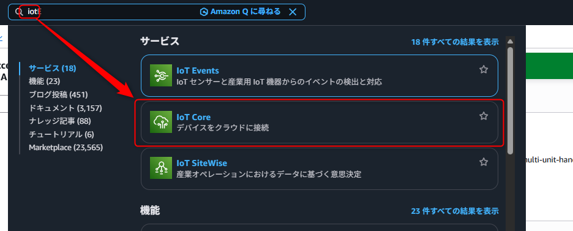

左のメニューの"管理">"メッセージのルーティング">"ルールの作成"をクリックします。

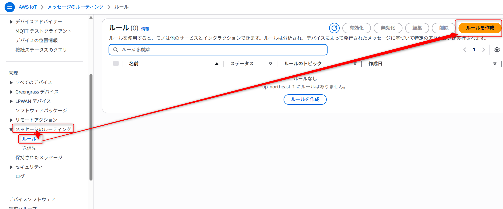

ルール名に`gps_multiunit_handson`と入力し、「次へ」をクリックします。

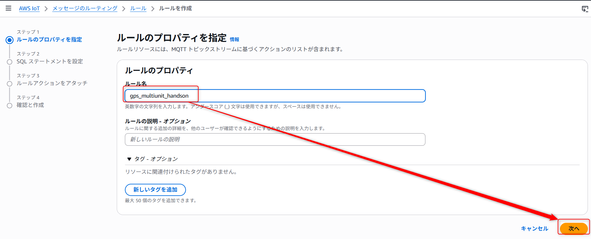

SQLのバージョンは`2016-03-23`を選択し、SQLステートメントに`SELECT * FROM 'GPSMultiUnitHandson'`と入力し、「次へ」をクリックします。

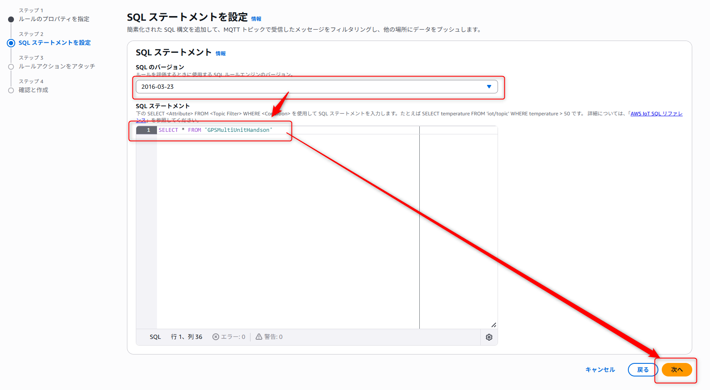

アクション1で”場所”を選び、”トラッカーを作成”をクリックします

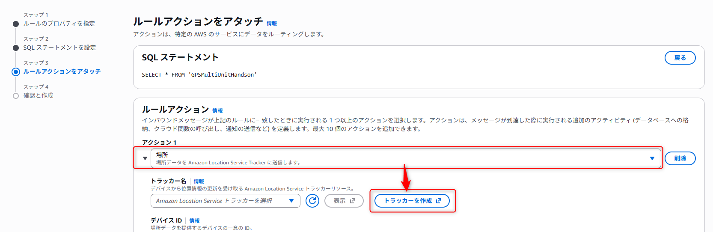

トラッカーの名前に`GPSMultiUnitHandson`と入力し、”位置のフィルタリング”は”精度ベースのフィルタリング”を選び、”トラッカーを作成"をクリックします。

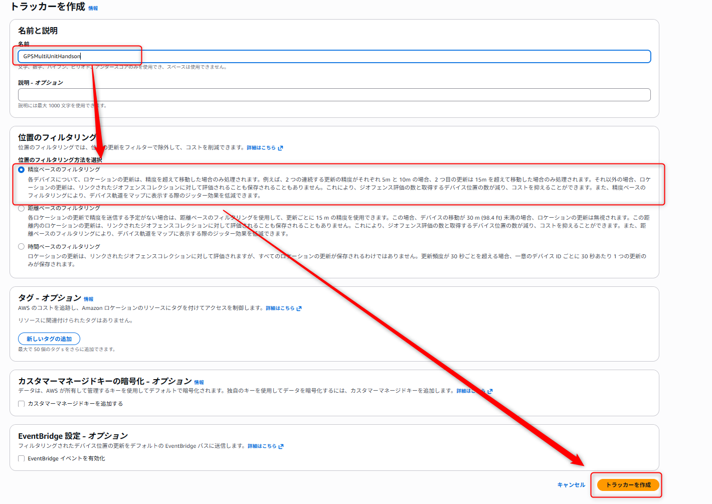

ルールアクションの設定ページに戻り、トラッカー名の横のリロードボタンをクリックして、先ほど作ったトラッカー名を選択します。

デバイスIDに半角英数字であなたのGPSマルチユニットを表す名前を入れます。これが後ほどLINEの画面に表示されます。他の人のデータと区別できるように分かりやすい名前を入れてください。
経度に`${payloads.lon}`,緯度に`${payloads.lat}`,タイムスタンプの値に`${timestamp()}`と入力します。タイムスタンプの単位は`MILLISECONDS`を選択します。

IAMロールの横の"新しいロールを作成"をクリックします。

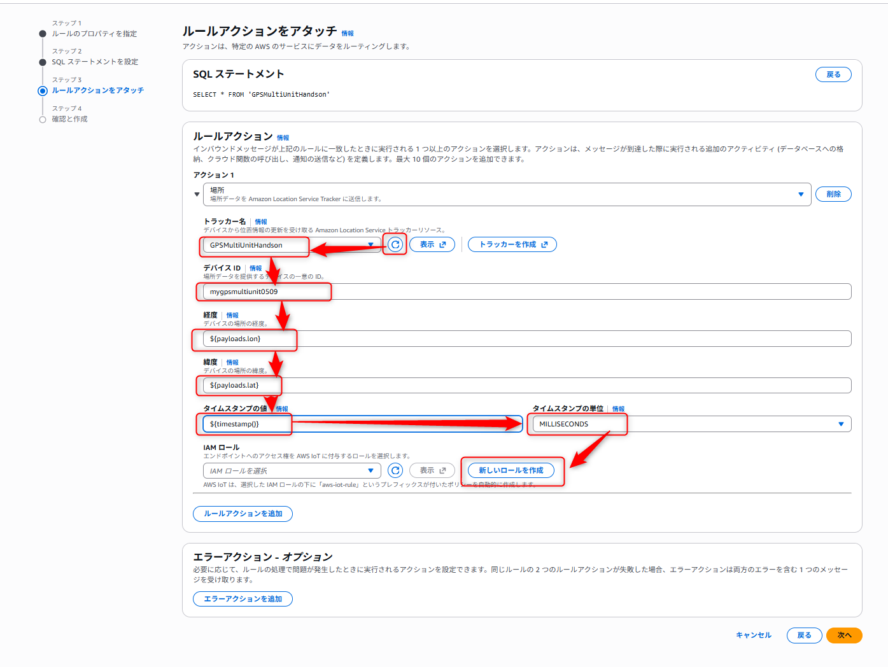

ロール名に`GPSMultiUnitHandson`と入れて"作成"をクリックします

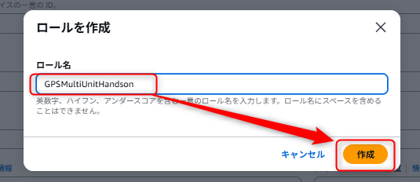

作成したロール名が選択されているのを確認し、"表示"をクリックします

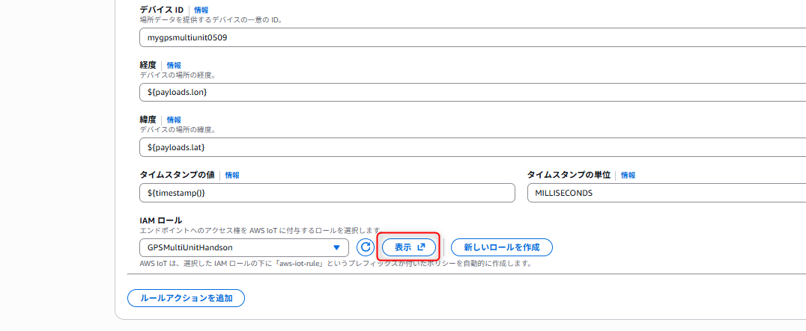

IAMロールの画面が別タブで開くので、"許可を追加">"インラインポリシーを作成"をクリックします

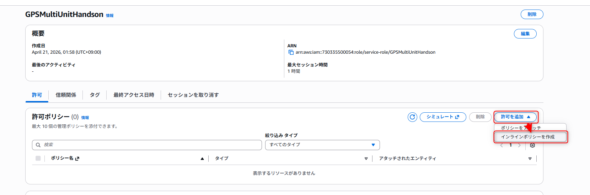

ポリシーエディッタの“サービス選択"で"Location"を選び、"アクション許可"で`BatchUpdateDevicePosition`を選択します。
"リソース"で"特定"を選び、"ARNを追加"をクリックします。

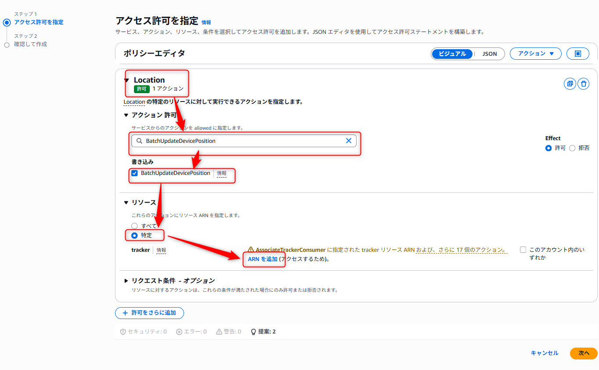

"次のリソース"で"このアカウント"を選び、"任意のリージョン"にチェックを入れ、Resource tracker nameに`GPSMultiUnitHandson`と入力して"ARNを追加"をクリックします。

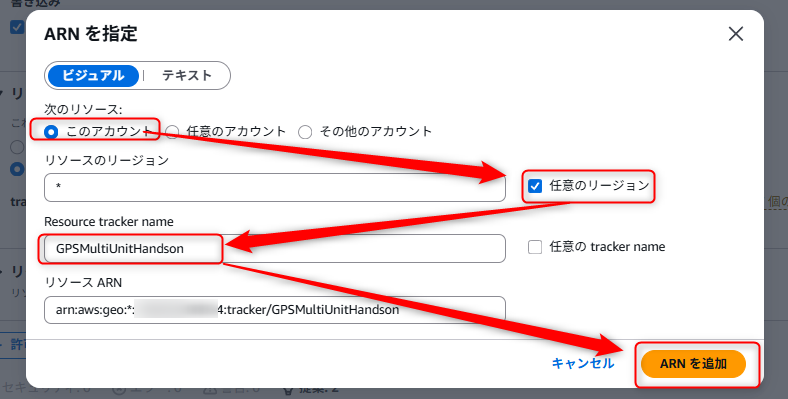

ARNが追加されたら"次へ"をクリックします。

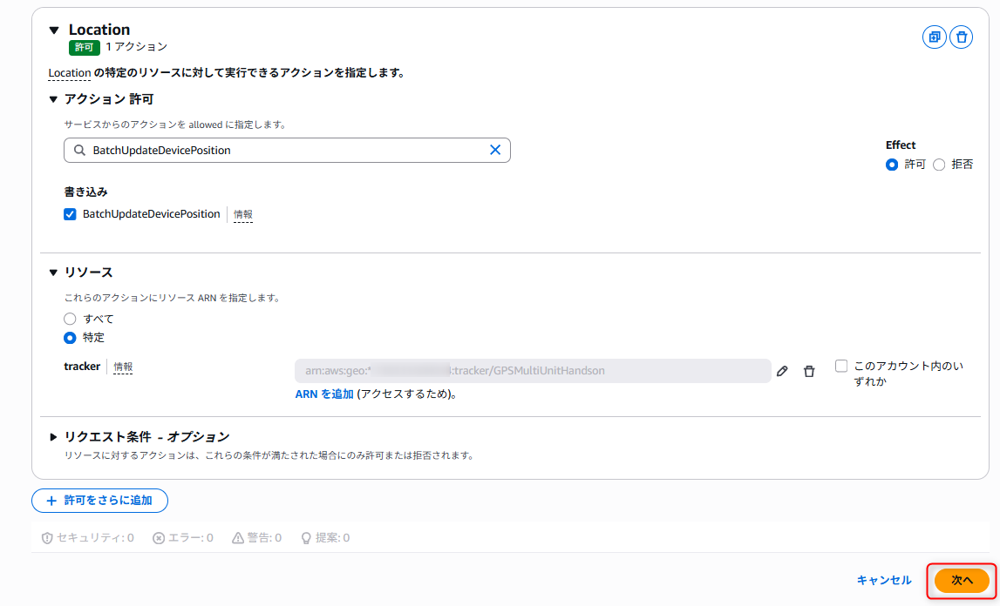

"ポリシー名"に`GPSMultiUnitHandsonLocationPolicy`と入力し、"ポリシーの作成"をクリックします

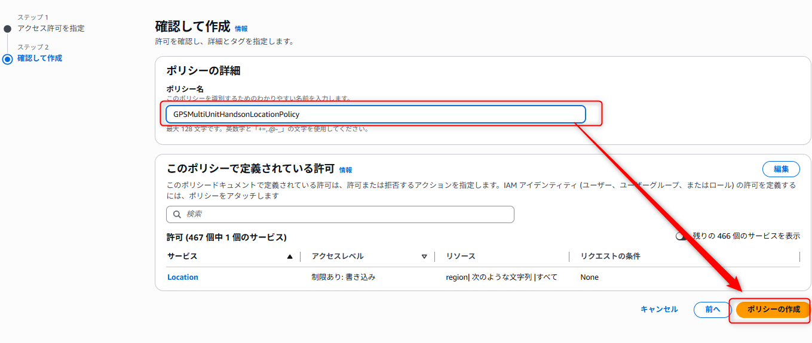

ルールアクションの設定ページに戻り、"次へ"をクリックします

確認ページで"作成"をクリックします

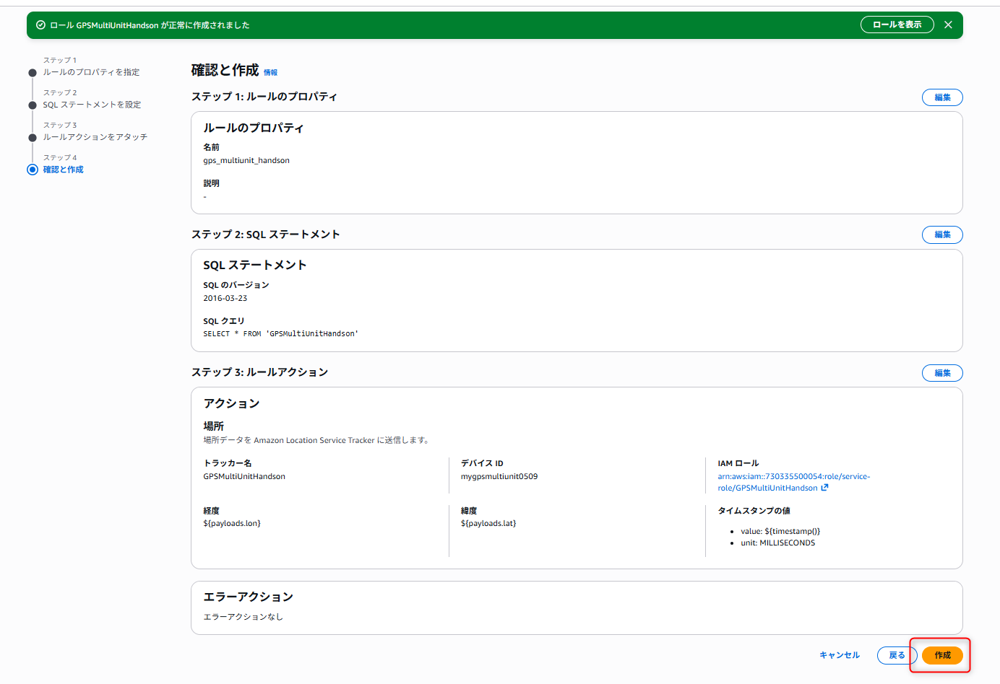

## ジオフェンスの設定をする

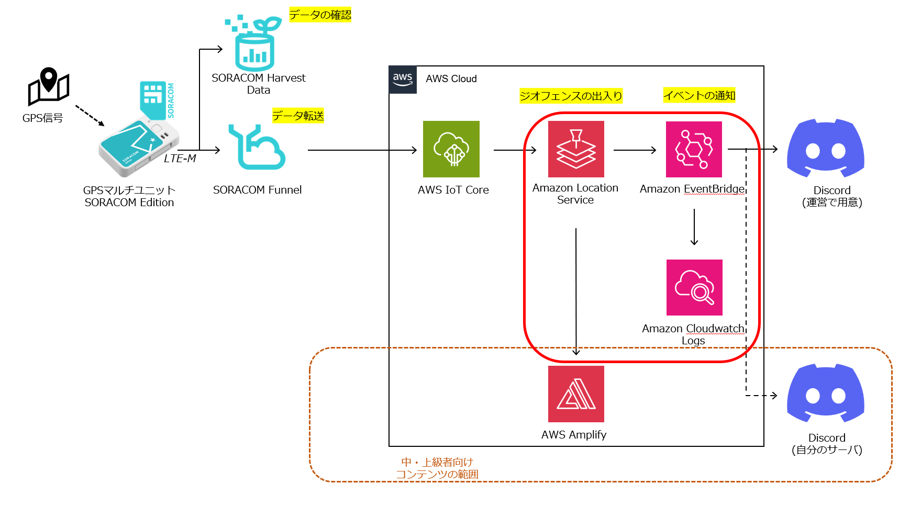

以下の手順でLocaiton Serviceのジオフェンスを準備します。
awsのコンソールで検索窓に”location”と入力し、表示されたサービスから"Amazon Location Service”を選択します。

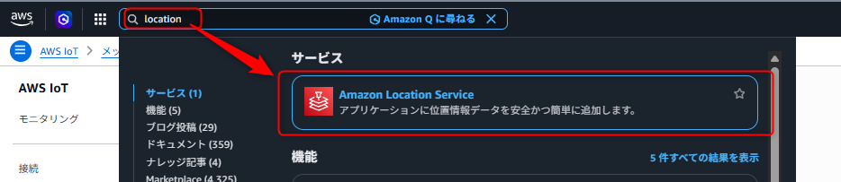

左上の三点リーダーをクリックしてメニューを開きます。

“ジオフェンス"をクリックします。

本日の会場を表すジオフェンス(地図の区域)を作ります。
"ジオフェンスコレクションを作成"をクリックします。

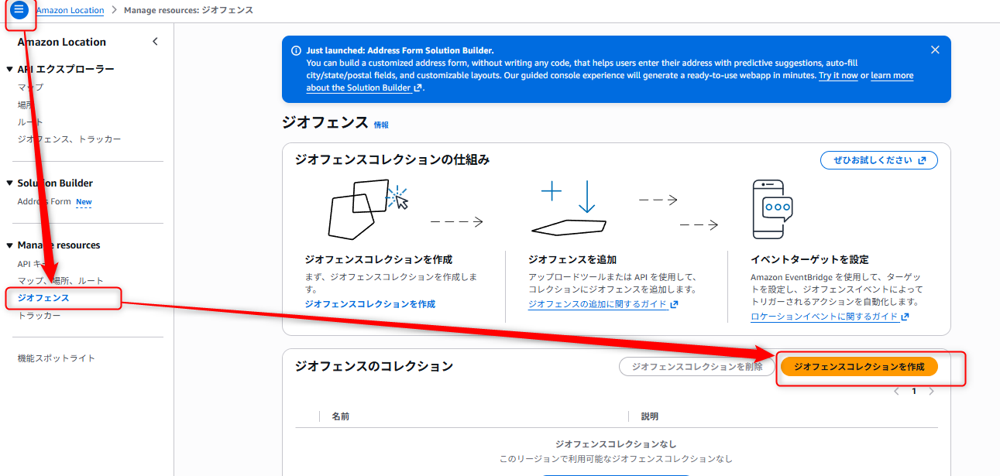

名前に`GPSMultiUnitHandson`と入力し、"CloudWatch をターゲットとする EventBridge ルール - オプション"は"はい、CloudWatch をターゲットとする EventBridge ルールを作成します"を選択します。

"ジオフェンスコレクションを作成"をクリックします。

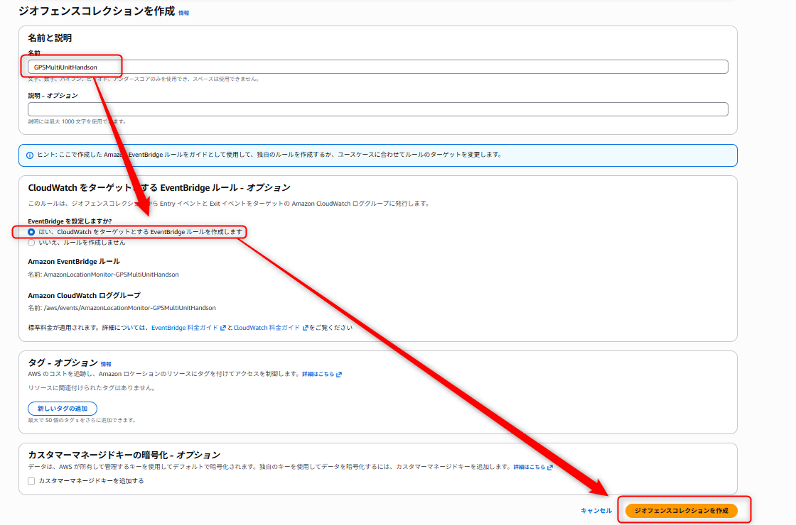

作成したジオフェンスコレクションで"ジオフェンスを追加"をクリックします。

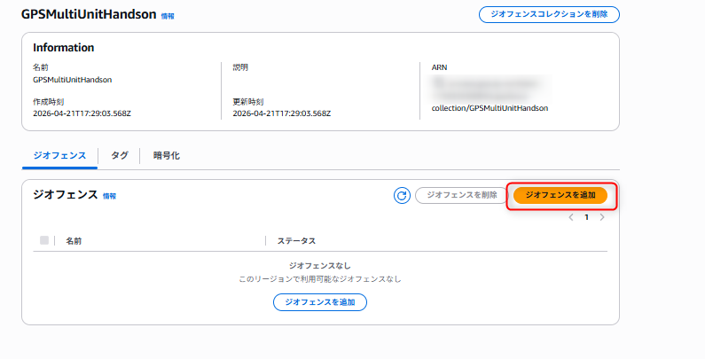

GeoJSONという形式のファイルをアップロードします。  
GoeJSONは [geojson.io](http://geojson.io/)を使って作ることもできますが、今回は運営が準備したファイルを以下からダウンロードして使ってください。
以下のように、建物を囲ったGeoJSONを準備しています。

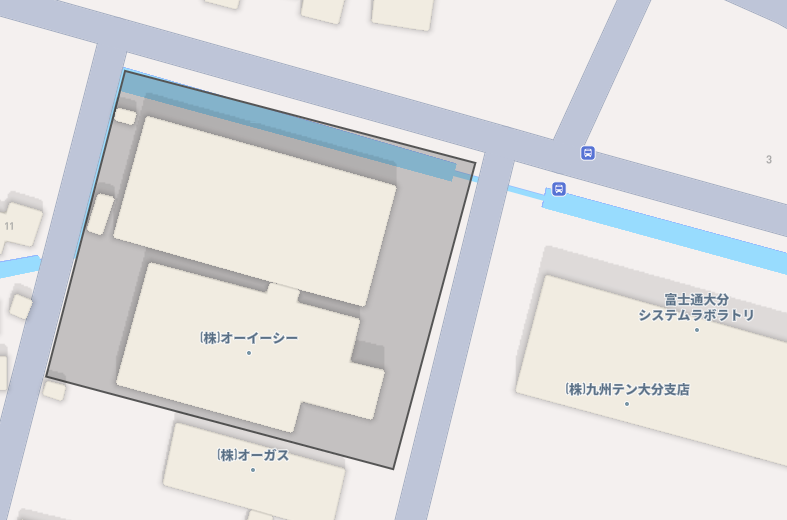

以下のファイルをダウンロードしてください。

[oec.json](../../src/oec.json)

左のメニューで"トラッカー"をクリックします。

”マイトラッカー”に先ほど作成したトラッカーが表示されているので、名前をクリックします。

"ジオフェンスコレクションをリンク"をクリックします。

先ほど作成したジオフェンスコレクションを選択し、"リンク"をクリックします。

## 動作確認(1)

ここで一度、動作確認します。
AWSコンソールの検索窓に”event"と入力し、表示されたサービスの一覧から"EventBridge"をクリックします。

左のメニューの"ルール"をクリックすると、先ほどジオフェンスを作成した際に作成されたルールがあるのでこれをクリックします。

"ターゲット"タブをクリックし、表示されたターゲット名をクリックします。

クリックすると以下のようにCloudWatchロググループが表示されます。

イベントが発生(ジオフェンシングの範囲にGPSマルチユニットが出たり入ったり)すると、こちらのログストリームにイベント内容が出力されます。  
GPSマルチユニットの位置がジオフェンシングの中や外になったかのように、手動で位置情報をIoT Coreに送ってみます。  
CloudWatchロググループのページを開いたまま、ブラウザの別のタブでAWSコンソールのIoT Coreのページへ移動します。  
AWSコンソールにアクセスし、サービスの検索窓に“iot”と入力し、表示されたサービスから “IoT Core” を選びます。

左のメニューの"テスト">"MQTTテストクライアント"をクリックし、"トピックのフィルター"に`GPSMultiUnitHandson`と入力し、"サブスクライブ"をクリックします。

先ほど確認したのと同じように、しばらく待っているとここにGPSマルチユニットから送信されるデータ(JSON)が表示されますのでそれをコピーしておきます。

画面上部の"メッセージペイロード"に先ほどコピーしたJSONを貼り付けます。

貼り付けたJSONのなかの”lat:”と”lon:”の部分に以下のデータを入れ、"発行"をクリックしてください。ジオフェンスの中と外の2つのデータがあるので、交互に発行することでジオフェンスに入った状態と出た状態を作ることができます。

ジオフェンスの中

```json
"lat": 33.24319342713308,
"lon": 131.59888873499483,
```

ジオフェンスの外

```json
"lat":33.24280832627794,
"lon": 131.5994303034214,
```

CloudWatchロググループを再読込してみて、ログストリームが表示されていたら、ログストリーム名をクリックします。

以下のようにログが出ていれば成功です。以下の例では”EventType”が”ENTER”になってるので、ジオフェンスの中に入ったというイベントになります。

CloudWatch Logs でジオフェンスのイベントが確認できなかった時のトラブルシューティング

IoT Core → Location Service → EventBridge → CloudWatch Logs というパイプラインになっているため、Location Service(のトラッカー)にデータが着信しているのかを確認します。

AWSコンソール右上、検索窓の右側にあるアイコンをクリックしてCloudShellを起動します。

以下のように、AWSコンソールの下の方にCloudShellのターミナル(コマンドを入力できる画面)が表示されます。

CloudShellに以下のコマンドを入力します。

```bash
aws --region ap-northeast-1 location get-device-position --device-id "あなたの設定したデバイスID" --tracker-name "GPSMultiUnitHandson"
```

以下のように、現在登録された位置情報が表示されれば、データは正しくトラッカーまで届いています。

届いていない場合、IoT Coreのルーティングの設定を間違えている可能性がありますので確認してください。  
デバイスのIDを間違えている可能性もあります。トラッカーの中の全てのデバイスの位置情報を出力するには以下のコマンドを入力します。

```bash
aws --region ap-northeast-1 location list-device-positions --tracker-name "GPSMultiUnitHandson"
```

位置情報の登録履歴を見るには以下のコマンドを入力します。

```bash
aws --region ap-northeast-1 location get-device-position-history –device-id  "あなたのデバイスID" --tracker-name "GPSMultiUnitHandson"  --start-time-inclusive "2023-11-03T00:00:00.000Z" --end-time-exclusive "2023-11-05T23:59:59.000Z"
```

CloudShellを終了するには、右上の×印をクリックします。

最終的には、CloudWatch Logs でジオフェンスのイベントが表示されるところまで確認してください。

## EventBridgeを設定する

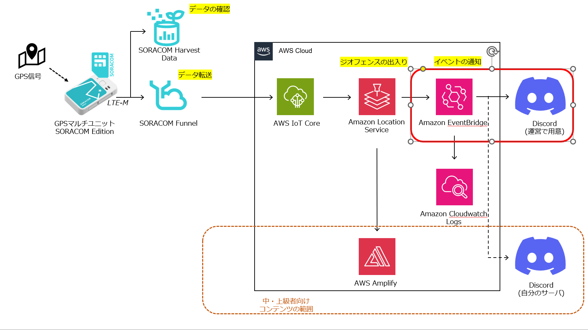

現時点ではGPSマルチユニットの位置情報がジオフェンスに入ったり出たりしたイベントは、CloudWatch Logsに出力されています。  
このイベントをDiscordにも送るように設定します。

AWSコンソールの検索窓に”event"と入力し、表示されたサービスの一覧から"EventBridge"をクリックします。

左のメニューの"ルール"をクリックすると、先ほどジオフェンスを作成した際に作成されたルールがあるのでこれをクリックします。

これまではこのルールでジオフェンスの全てのイベントを対象にしていましたが、ここからは入ったときと出たときのイベントでメッセージを変えたいのでフィルターを設定します。  
画面右のペインの"トリガーイベント"のところの"イベントパターン(フィルター)"をクリックし、"EventType"のところで"演算子"で"等しい"を選び、"値"に`ENTER`と入れます。これで、ジオフェンスに入ったイベントがこのルールの対象になります。

入力したら"更新"をクリックします。

次に画面左のペインの"ターゲット"タブをクリックし、"EventBridge API送信先"を探します。これをドラッグして画面右のペインの"ターゲット"のところにドロップします。

ドロップした"EventBridge API送信先"をクリックして、"ターゲット設定"画面を開きます。画面右ペインの下側に表示されます。

"EventBridge APIの宛先を作る"をクリックすると、別のタブまたはウインドウが開きますので、以下のように入力します。

| 項目                     | 値                                     |
| ------------------------ | -------------------------------------- |
| 名前                     | `GPSMultiUnitHandsonDiscord`           |
| API 送信先エンドポイント | 運営から提供されたDiscordのWebhook URL |
| HTTPメソッド             | POST                                   |

"接続タイプ"で"新しい接続を作成"を選択し、以下のように入力します。

| 項目       | 値                                      |
| ---------- | --------------------------------------- |
| 接続名     | `GPSMultiUnitHandsonDiscordConnection`  |
| APIタイプ  | "パブリック"を選択                      |
| 認証タイプ | "カスタム設定"を選択し、"APIキー"を選択 |
| APIキー名  | `x-api-key`                             |
| 値         | `GPSMultiUnitHandsonDiscordAPIKey`      |

DiscordのWebhook URLはURL自体に認証情報が含まれているため実際はAPIキーは必要ないのですが、EventBridge API送信先の接続の認証タイプで"カスタム設定"を選択した場合、APIキーの入力が必須になるため、適当な値を入れてください。

"作成"をクリックします。

EvendBridgeの画面(タブ)に戻り、"API送信先"のプルダウンの右側の再読み込みボタンを押し、プルダウンで先ほど作成した送信先を選択します。

"更新"を押して設定を保存します。

次に、このAPI送信先に対してどのような内容のデータを送るかを設定します。画面右ペインの"ターゲット"の中で、"入力変換"を押して編集画面を開きます。

"ターゲット入力変換"のスライダーを"有効化"にし、"変換方法"で"入力トランスフォーマー"を選択します。  
"入力パス"に以下を貼り付けます。

```json
{
  "deviceId": "$.detail.DeviceId"
}
```

そして、テンプレートに以下を貼り付けます。

```json
{
  "content": "いってらっしゃい、 <deviceId>"
}
```

"更新"をクリックして保存します。

続けて、ジオフェンスから出たときのイベントも同様に設定します。

EventBridgeのページに戻り、"ルール"から"ルールを作成"をクリックします。

画面左のペインの"イベント"で"AWSサービスイベント"を選び、"Location Geofence Event"を選んで画面右のペインにドラッグアンドドロップします。  
イベントパターン(フィルター)を開き、"EventType"のところで"演算子"で"等しい"を選び、"値"に`EXIT`と入れます。これで、ジオフェンスから出たイベントがこのルールの対象になります。

続いて先ほどと同じく"ターゲット"を設定していきます。"API送信先"は先ほど作ったものがあるのでそれを選択します。

"ターゲット"の"入力変換"も先ほどと同様に設定し、JSONの値は以下のように設定します。

```json
{
  "content": "おかえりなさい、 <deviceId>"
}
```

"作成"をクリックし、"Rule name"に`GPSMultiUnitHandsonGeofenceExit`と入力して、"作成"をクリックします。

## 動作確認(2)

先ほどと同じく、IoT CoreのページからMQTTテストクライアントを開いて、ジオフェンスの中と外の位置情報を交互に発行してみてください。正しく設定されていれば、Discordにあなたの設定したGPSマルチユニットのデバイス名を含んだメッセージが届きます。

## 動作確認(3)

GPSマルチユニットを持って、建物の外に出て散歩して戻ってきてみてください。Discordに先ほどと同じくメッセージが届いていれば成功です。

次:  
Advanced: [中・上級者向け追加コンテンツ](../chapter5/README.md)  
99: [後片付け](../chapter99/README.md)

前: [3: SORACOM Funnel設定](../chapter3/README.md)
