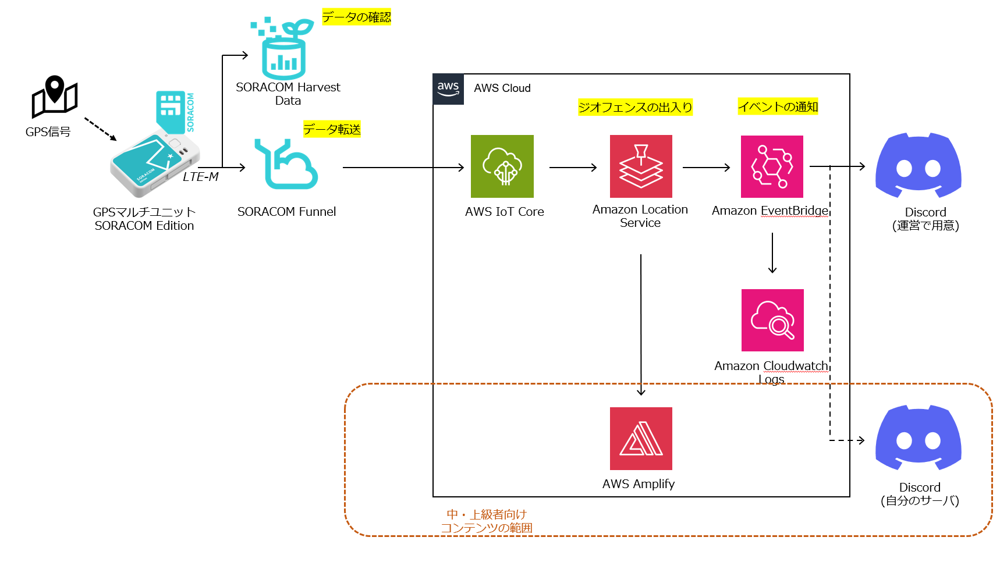

# Advanced: 中・上級者向け追加コンテンツ

早めに課題が終わった方は、以下の追加コンテンツにも是非チャレンジしてみてください。  
(それぞれのコンテンツは独立していますので、順に行わないといけないということはありません)

## 自身のDiscordやSlackに対して通知を行ってみる

ご自身のDiscordのサーバをお持ちの場合は、以下のドキュメントを参考にしてWebhookのURLを作成し、API送信先のURLに設定してみてください。

[Webhooksへの序章](https://support.discord.com/hc/ja/articles/228383668-%E3%82%BF%E3%82%A4%E3%83%88%E3%83%AB-Webhooks%E3%81%B8%E3%81%AE%E5%BA%8F%E7%AB%A0)

Slackのチャンネルをお持ちの方は、以下のドキュメントを参考にしてIncoming WebhookのURLを作成し、そこに送信するようにしてみてください。  
EventBridgeで、API送信先にデータを送る際の変換形式を少し修正する必要があります。

[Incoming Webhooks](https://docs.slack.dev/tools/java-slack-sdk/ja-jp/guides/incoming-webhooks/)

## ジオフェンスを自分で作ってみる

[geojson.io](http://geojson.io/) にアクセスすると、ブラウザ上で地図をクリックしながらGEOJsonのデータを作ることができます。  
ここで作ったデータを保存し、ジオフェンスにアップロードして使ってみましょう。

テストデータは、IoT Core の時に行った動作確認で行えます。

## 可視化してみる

Amazon Location Serviceには、ブラウザやアプリなどに地図を描画する機能も存在します。トラッカーに蓄積された位置情報を地図上に表示し、可視化してみましょう。  
AWS公式コンテンツである[Getting Started with Amazon Location Service (workshops.aws)](https://catalog.workshops.aws/amazon-location-101/en-US)を行うことで、以下の事を体験できます。

- Amazon Location Service のマップを Web アプリケーションに埋め込む方法
- Amazon Location Service のプレース API を用いた、ジオコーディングや逆ジオコーディング、検索候補の提供する方法
- Amazon Location Service のルートを使用した、地点間の時間/距離を決定し、ルートを最適化する方法
- Amazon Location Service のジオフェンスとトラッキングを用いて、アセットを追跡し、移動に対して通知を出す方法

GPSマルチユニットからIoT Coreに送られたデータをこのコンテンツで作成したトラッカーに送り込むことで、GPSマルチユニットの情報を可視化することができます。

次: 99: [後片付け](../../chapter99/README.md)

前: 4: [IoT Core設定～LocationService設定～動作確認](../chapter4/README.md)
