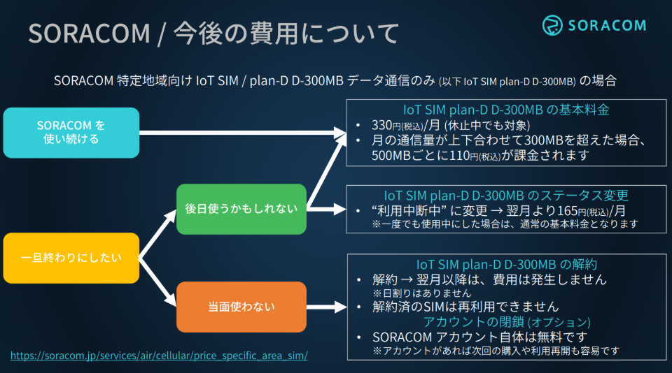

# 99: 後片付け

後片付けの手順を解説します。

## SIMグループの削除

SIMグループを削除するには、紐づいているSIMグループを削除してから削除する必要があります。  
SIMの紐付け解除は、SIMグループの登録と同じ手順で、SIMを選択して、SIMの所属グループ変更画面を表示します。  
新しい所属グループで[グループ解除]を選択して、登録すれば解除されます。  

SIMグループの削除は、SIMグループ設定画面右上の[削除]をクリックします。

問題なければそのまま[削除する]をクリックします。これで完了です。

なお、SIMの紐付けがあると、エラーになりますので、必ずSIMの紐付けを全部解除してから行ってください。

## SIM について

後片付けの手順にある以下の手順を実施した上で、GPSマルチユニットからSIMカードを外してください

貸し出しの方の追加確認: GPSマルチユニットをお返しください

SIMカードはお持ち帰りいただけます。

SIMカードは、今回新規に開通したことで月額330円の課金が発生します。それを相殺するクーポンをソラコム様よりいただいていますので、みなさんのアカウントに適用してください。

## クーポンの適用方法

クーポンの適用は、[SORACOMコンソール](https://console.soracom.io/)にログイン後、右上のご自身のメールアドレスが表示されている部分をクリックして表示されたメニューから"クーポン登録・一覧"をクリックしてください。

また、今後このSIMをご利用になることが無い場合は解約してください。SORACOMコンソールの左上のメニューから”SORACOM AIR FORセルラー”>”SIM管理”をクリックします。

該当のSIMの左のチェックボックスをチェックし、"操作"をクリックして出てきたメニューの"解約"をクリックします。

## 来月以降の SIM の料金

## 全員

今回作成したAWSのリソースを削除します。

1. IoT Coreのルール
AWSコンソールのIoT Coreのページから、該当のルールにチェックを入れて"削除"をクリックします。

2. Location Serviceのトラッカーならびにジオフェンシング
AWSコンソールのLocation Serviceのページの"トラッカー"でトラッカーを選び、"トラッカーを削除"をクリックします。

"ジオフェンスのコレクション"でジオフェンスコレクションを選択し、"ジオフェンスコレクションを削除"をクリックします。

3. EventBridgeのルール
AWSコンソールのEventBridgeのページで、"ルール"からルールにチェックを入れ、"削除"をクリックします。

4. Lambda関数
AWSコンソールのLambdaのページで、"関数"から関数にチェックを入れ、"アクション">"削除"をクリックします。

5. IAMユーザー
AWSコンソールのIAMのページで"ユーザー"からユーザーにチェックを入れ、"削除"をクリックします。

いずれも今回利用した範囲は無料枠で利用いただけ、今後もIoT Coreへのデータの投入がなければ料金は発生しませんが、念の為に削除ください。

以上です、お疲れさまでした！

---
[1: GPSマルチユニット初期設定(SIM登録～SIM取り付け)](../chapter1/README.md)  
[2: ガジェット設定〜Harvest動作確認](../chapter2/README.md)  
[3: SORACOM Funnel設定](../chapter3/README.md)  
[4: IoT Core設定～LocationService設定～動作確認](../chapter4/README.md)  
[5: 中・上級者向け追加コンテンツ](../chapter5/README.md)
